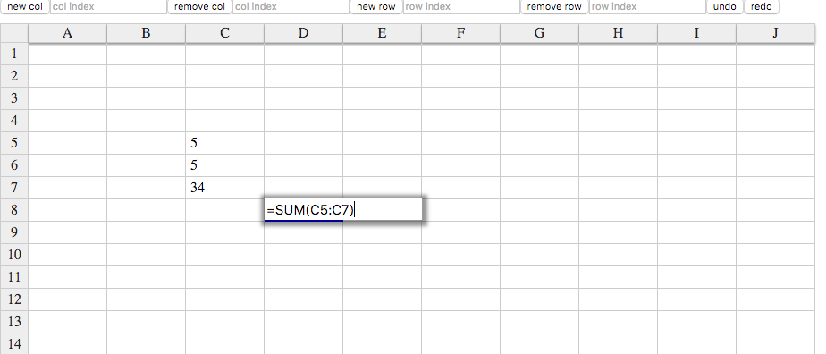

# RIXIF

In early 2015, I had wanted to impliment an entire excel experience in javascript.

With React, Immutable.js, and old school vanilla flux, I got pretty far:



I've never had time to finish it, but it does support all of these excel formulas:

- and
- average
- averageif
- concatenate
- count
- countif
- if
- left
- len
- mid
- or
- right
- square
- sum
- sumif
- trim
- vlookup

# Architecture
## Immutable State:
Before Redux was all the rage, I was drawing ideas from Clojurscript libraries like reframe. All of my state and data came from a single store, and all of the app's state is comprised of commands. This made undo redo possible.

I had the idea that these commands could be branched and rebased on for a sort of git like interface. Not enough time to impliment that unfortunately. 

## DSL
The excel formulas typed in by the user are parsed into javascript functions. The formulas work against arrays, matrices and single values (as appropriate).

# Running the app
```
$ gulp dev
$ cd dist
$ python -m SimpleHTTPServer
```
go to localhost:8000
